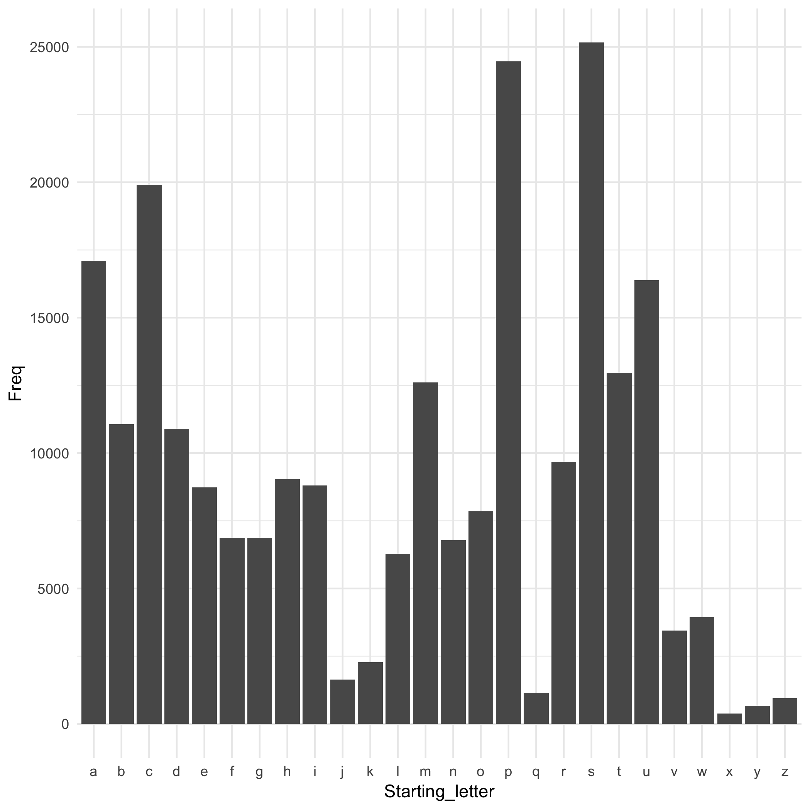

The following text is adapted from Jenny Bryan's report on English Word lengths from [this activity](https://github.com/STAT545-UBC/make-activity).

On most *nix systems, the file `/usr/share/dict/words` contains a bunch of words. On my machine, it contains 235886 words.

I took count of the starting letter of each word, and tabulated how many words started with a, b, c, etc.

The most frequent starting letter is s.

Here is a histogram of starting letters.

